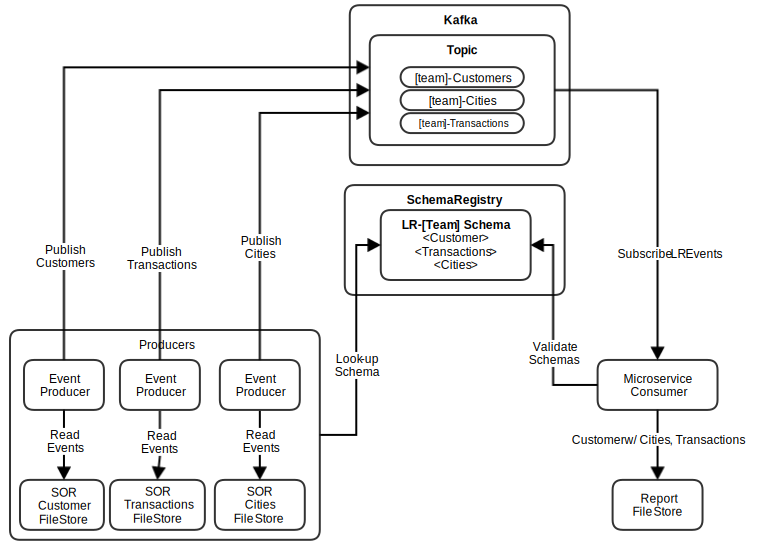

# Kafka Bootcamp use case 3: KStream join

## Prerequisites
A working version of use case 1 producing to the 3 topics:
```
[your_team]-Transactions
[your_team]-Customers
[your_team]-Cities
```

## How to run
This is a spring boot project.  Check out the project to your machine.

### In application.properties, update these fields to match your settings:
```
# Source Transactions topic from use case 1
topic.trxn.name=[your_team]-Transactions

# Source Customers topic from use case 1
topic.cust.name=[your_team]-Customers

# Kafka uses RocksDB to store stream states.  
# DOES NOT WORK ON WINDOWS: It will try to create a directory name containing a colon.
stream.state.dir=/your/favourite/dir

# Same story as use case 1.  Jaas file for authentication.
writable.dir=/your/favourite/dir
```

### To run the project
```
mvn spring-boot:run
```


## Kafka Streams
Our Kafka Streams are defined in KafkaStreamConfig.java using the stream DSL.

We use StreamsBuilder to define a transaction stream and customer stream.

Then we re-key the transaction stream with custId as key, and finally join it with the customer stream.

## High-level diagram



